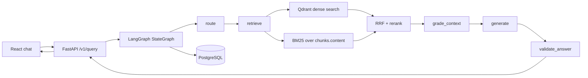

# ContextForge Architecture

## Overview

ContextForge is an agentic RAG system that ingests policy-like documents and answers user questions with citations. The runtime emphasizes:
- explicit query routing
- hybrid retrieval
- abstain behavior when context is weak
- end-to-end observability and evaluation

## System boundaries

| Store | Responsibility |
|-------|----------------|
| **PostgreSQL** | Documents, chunks, threads, messages, optional LangGraph checkpoint tables |
| **Qdrant** | Dense vector ANN retrieval (`chunk_id` as point id) |

Qdrant remains the active vector backend today. `chunks.qdrant_point_id` links relational rows to vector points.

## Request flow

## Agent graph nodes

1. **route** — classify as `direct`, `single_hop_rag`, or `multi_hop`
2. **retrieve** — dense + sparse retrieval, RRF merge, rerank
3. **grade_context** — decide abstain if top evidence score is below threshold
4. **generate** — compose answer from retrieved contexts (or abstain response)
5. **validate_answer** — final grounding check before return

## LLM provider routing

`LLM_PROVIDER` is selected from environment config and applies to all LLM-like node logic (`route`, `generate`, `grade_context`, `validate_answer`).

| Provider | Route | Generate | Grade / Validate | Notes |
|----------|-------|----------|------------------|-------|
| `heuristic` | heuristic rules | template response | lexical grounding checks | default local mode |
| `openai` | Instructor + OpenAI | heuristic fallback today | heuristic fallback today | requires `OPENAI_API_KEY` |
| `pydantic_ai` | Pydantic AI | heuristic fallback today | heuristic fallback today | requires `OPENAI_API_KEY` |
| `ollama` | Ollama chat JSON | Ollama chat text | Ollama chat JSON | local provider via `OLLAMA_BASE_URL` + `OLLAMA_MODEL` |

If the active provider call fails or returns malformed output, the dispatcher falls back to the same heuristic behavior used in default mode.

## API contract: snake_case internally, camelCase on the wire

- Python model fields are `snake_case`
- JSON payloads are `camelCase`
- Request/response models inherit from `app/schemas/base.py`:
  - `BaseRequest`
  - `BaseResponse`

This allows frontend clients to send `threadId` while tests/internal callers may still send `thread_id`.

## Design tradeoffs

1. **Qdrant + Postgres split**  
   Keep relational state and vector search concerns separate; easier to reason about today, with a clear future path to Postgres-only retrieval if needed.

2. **Hybrid retrieval over dense-only**  
   Dense search catches paraphrase; BM25 catches exact policy terms and numeric strings. RRF avoids brittle score normalization.

3. **Abstain over forced answer**  
   If evidence is weak, return a controlled abstain response rather than hallucinating.

## Evaluation architecture

Evaluation lives under `eval/`:
- `golden.jsonl` — curated QA set (includes abstain case)
- `run_ragas.py` — full RAGAS run + heuristic fallback mode
- `golden_loader.py` — golden set validation
- `heuristic_metrics.py` — lexical overlap and abstain checks
- `report_writer.py` — JSON + markdown reports in `reports/`

Run modes:
- `just eval-dry` (schema/row validation only)
- `just eval-heuristic` (no OpenAI required)
- `just eval` (full RAGAS)

## Tooling

| Area | Stack |
|------|-------|
| API | FastAPI, Pydantic v2, structlog |
| Orchestration | LangGraph `StateGraph` + optional `AsyncPostgresSaver` |
| Retrieval | Qdrant, rank-bm25, RRF, rerank |
| Frontend | Vite, React, Tailwind v4, Biome, Vitest, pnpm |
| Developer tasks | just |

## Planned retrieval backend switch (optional)

`RETRIEVAL_BACKEND` is already reserved in config:
- `qdrant` (**implemented**)
- `postgres` (**planned**: pgvector + FTS)

Future plan is tracked with code markers:
- `TODO(retrieval-backend)`
- `TODO(retrieval-backend-ui)`

Start point: `app/retrieval/factory.py`.
