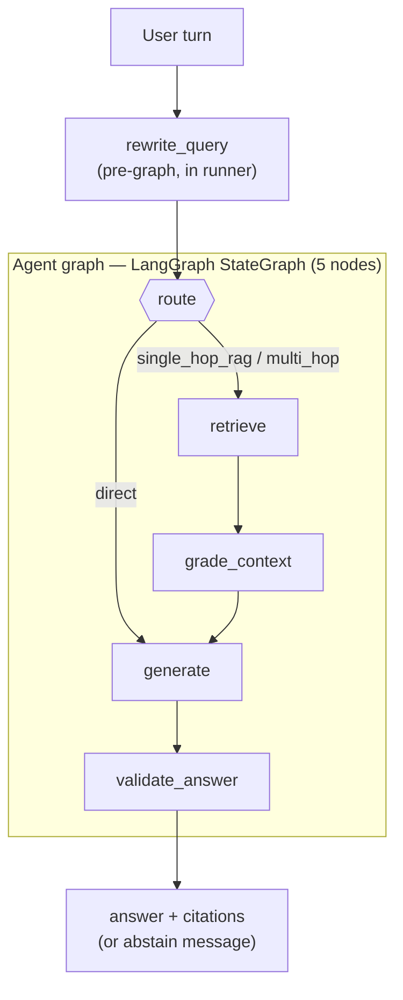

# ContextForge Architecture

## Overview

ContextForge is an agentic RAG system that ingests policy-like documents and answers
user questions with citations. The runtime is designed for portfolio / demo quality:
deterministic on the seeded corpus, modern RAG patterns visible end to end, no
production infra (Kubernetes, multi-tenant auth, autoscaling) included.

Key properties:

- **One LLM provider abstraction.** Every LLM call (rewrite, route, grade, generate,
  validate) goes through a single `LLMProvider` Protocol.
- **One ordering signal end to end.** A `RetrievedChunk` carries every stage's score
  (`dense`, `sparse`, `rrf`, `rerank`); downstream code consults `ranking_score()`
  so there is no silent score mixing.
- **Generation, citations and validation see the same chunks.** No more "we cited
  X but validated against Y".
- **Async-safe hot path.** CPU-bound encoders run via `asyncio.to_thread`; no graph
  node blocks the event loop.
- **Deterministic eval as a CI gate.** `pytest -m eval` runs the real graph over an
  in-memory corpus + heuristic provider on every push.

## Repository layout

```
contextforge/
├── ARCHITECTURE.md
├── README.md
├── docker-compose.yml          # Postgres + Qdrant (+ optional full stack)
├── justfile                    # task runner: infra, tests, eval, lint, web
├── backend/                    # FastAPI + LangGraph service (Python, uv)
│   ├── Dockerfile
│   ├── alembic/                # DB migrations
│   ├── alembic.ini
│   ├── pyproject.toml          # deps + ruff / pyright / pytest config
│   ├── pyrightconfig.json
│   ├── uv.lock
│   ├── app/
│   │   ├── main.py             # FastAPI app factory
│   │   ├── router.py           # mounts the /v1 sub-routers
│   │   ├── startup.py          # lifespan: Qdrant collection + checkpointer setup
│   │   ├── api/v1/
│   │   │   ├── documents/      # ingest + list (router/service/repository/schemas)
│   │   │   ├── health/         # GET /v1/health
│   │   │   ├── metrics/        # process-local query/ingest counters
│   │   │   ├── query/          # sync + SSE RAG endpoints (+ streaming.py)
│   │   │   └── threads/        # conversation CRUD + message history
│   │   ├── core/               # config, constants, logging, middleware, exceptions
│   │   ├── db/                 # SQLAlchemy base, models, async session
│   │   ├── graph/              # LangGraph: builder, nodes, state, runner, chunks,
│   │   │                       #   conversation, checkpointer, pipeline
│   │   ├── ingestion/          # contextual chunker + ingestion service
│   │   ├── llm/                # providers/ (base, factory, heuristic, ollama, openai),
│   │   │                       #   prompts/, models, grading, structured, retrieval_query
│   │   ├── retrieval/          # embeddings, hybrid, rerank, qdrant_store,
│   │   │                       #   dedupe, factory, models
│   │   └── schemas/            # base (camelCase alias generator), errors
│   └── tests/                  # pytest unit suite + `-m eval` golden gate + eval_harness
├── eval/                       # RAGAS pipeline + golden set
│   ├── golden.jsonl            # 20 Q/A rows (3 expect-abstain)
│   ├── golden_loader.py
│   ├── heuristic_metrics.py
│   ├── report_writer.py
│   └── run_ragas.py
├── sample_corpus/              # seed policy docs (PTO, remote work, security)
├── scripts/                    # seed_corpus, demo.sh, dump/wipe db helpers
├── docs/                       # design notes, plans, coding standards
└── web/                        # Vite + React + Tailwind v4 frontend (pnpm)
    ├── package.json
    ├── biome.json
    ├── vite.config.ts
    ├── index.html
    └── src/
        ├── App.tsx
        ├── main.tsx
        ├── components/         # Chat, Citations, ConversationSidebar, DebugPanel, …
        ├── hooks/              # useChat, useSSE, chatReducer
        ├── constants.ts
        └── types.ts
```

## System boundaries

| Store | Responsibility |
|-------|----------------|
| **PostgreSQL** | Documents, chunks, threads, messages, optional LangGraph checkpoint tables |
| **Qdrant** | Hybrid ANN retrieval — named `dense` + `sparse` vectors per point (`chunk_id` as point id) |

`chunks.qdrant_point_id` links relational rows to vector points.

> **Migration note (PR7 — Qdrant-native hybrid).** The Qdrant collection schema
> changed from a single **anonymous** dense vector to **named** vectors — a `dense`
> vector (`vectors_config`) plus a `sparse` vector (`sparse_vectors_config`, FastEmbed
> `Qdrant/bm25`) — so server-side RRF fusion happens inside Qdrant. This is a
> **breaking** collection-layout change: any collection created before PR7 must be
> **dropped and re-ingested** (the old anonymous-vector points are incompatible with
> the named-vector queries). Re-seed with `just seed`.

## Request flow

`rewrite_query` runs **before** the graph (in the runner's `prepare_query_run`), not
as a graph node. The compiled LangGraph `StateGraph` has exactly **five** nodes —
`route`, `retrieve`, `grade_context`, `generate`, `validate_answer` — with a single
conditional edge after `route`. Abstaining is not a node: it is an `abstained` flag set
in state and honored downstream.



Internals not drawn above:

- **retrieve** runs dense + sparse retrieval, RRF fusion (k=60), rerank, and content
  dedupe inside the one node. For `multi_hop`, it issues a **second** hybrid pass with a
  `"{retrieval_query} details"` query and merges the de-duplicated results.
- **grade_context** sets `abstained=True` when the evidence is too weak; the edge to
  `generate` is unconditional.
- **generate** calls `select_chunks_for_generation` internally (so selection happens
  *after* grading), then generates + cites. If `abstained` is set, it emits the abstain
  message instead.
- **validate_answer** flips a grounded answer to the abstain message if entailment fails.

## Agent graph nodes

1. **route** — classify the latest message as `direct`, `single_hop_rag`, or `multi_hop`.
2. **retrieve** — dense (Qdrant) + sparse (BM25) retrieval, RRF fusion, async cross-encoder
   or lexical rerank, content dedupe. `multi_hop` adds a second hybrid pass and merges.
3. **grade_context** — abstain when no reranked chunk meets the backend-specific minimum
   score (`grade_min_score` for lexical rerank, `grade_min_score_cross_encoder` for the
   cross-encoder; both are `Settings` fields, overridable via the `GRADE_MIN_SCORE` /
   `GRADE_MIN_SCORE_CROSS_ENCODER` env vars, defaulting to `0.25` and `0.0`). The score is
   the only ordering signal here on purpose — no token-level / per-language heuristics.
   When scores abstain, a provider LLM judge is consulted as a second opinion (skipped for
   the `heuristic` provider).
4. **generate** — `select_chunks_for_generation` takes the top reranked chunk, then adds
   further chunks that are both above the grade threshold and within
   `CITATION_SCORE_RELATIVE_MIN` (0.9) of the top score, capped at `MAX_GENERATION_CONTEXTS`
   (3). The active provider generates a cited answer from that subset.
5. **validate_answer** — provider's entailment check over the **same** selected chunks
   the answer was generated from. Ungrounded answers are replaced with the abstain message
   and their citations are cleared.

State carries `_chunks` (full retrieved set) and `_selected_chunks` (subset used for
generation, citations, and validation). Both are stripped by `_finalize_graph_state`
before the state leaves the graph and reaches the HTTP layer.

## Score-correct retrieval

`RetrievedChunk` keeps **every** stage's score:

| Field | Stage |
|-------|-------|
| `dense_score` | Qdrant cosine similarity |
| `sparse_score` | BM25 score |
| `rrf_score` | Reciprocal Rank Fusion |
| `rerank_score` | Lexical blend or cross-encoder logit |
| `score` | Whatever the latest stage set (tracks the most recent stage) |

(`relevance_score` also exists as a deprecated back-compat field slated for removal.)

Callers must use `chunk.ranking_score()`, which returns the most recent of
`rerank_score → rrf_score → score`. Grading, generation and citation selection all
use this single ordering signal.

## LLMProvider Protocol

Defined in `app/llm/providers/base.py`:

```python
class LLMProvider(Protocol):
    name: str

    async def rewrite_query(self, history, latest) -> RewrittenQuery: ...
    async def route(self, message) -> RouteDecision: ...
    async def grade(self, *, query, chunks, threshold, conversation=None) -> RetrievalGrade: ...
    async def generate(self, *, query, contexts, route, chat_history=None,
                       retrieval_query=None) -> str: ...
    async def validate(self, *, answer, contexts) -> AnswerValidation: ...
```

Implementations:

| Provider | Used when | Backed by |
|----------|-----------|-----------|
| `HeuristicProvider` | `LLM_PROVIDER=heuristic` (default; tests, offline) | Pure Python: rules, token overlap, score thresholds |
| `OllamaProvider` | `LLM_PROVIDER=ollama` | Local Ollama chat API (default `llama3.2`) |
| `OpenAIProvider` | `LLM_PROVIDER=openai` (requires `OPENAI_API_KEY`) | OpenAI Chat + Instructor for structured outputs |

Selected once per process by `app.llm.providers.get_llm_provider()` (settings-keyed
memo with a `reset_llm_provider_cache()` escape hatch for tests). `structured.py`
is a thin dispatcher; node-level code never touches provider-specific symbols. The
Ollama and OpenAI providers fall back to the heuristic implementation when a live call
raises or returns an unusable response, so a transient backend failure degrades rather
than 500s.

## Multi-turn rewrite

`build_retrieval_query` is provider-agnostic. The provider returns a
`RewrittenQuery { search_query, references_prior_turn }`. Both retrieval **and**
generation receive this; the generator gets the resolved subject so a pronoun
follow-up like "so is it mandatory?" is answered against the right topic. Thread
history is loaded by `graph/conversation.py` (`load_recent_thread_messages`, last
`CONVERSATION_HISTORY_LIMIT=10` turns) before the graph runs.

## Structural context prefix (chunking)

`split_text_into_chunks` adds a **structural** context prefix (not the LLM-generated contextual-retrieval technique — that is planned, see the adoption plan):

- Walks Markdown headings to identify sections (heading-less text falls back to a
  `Body` section).
- Recursive character splitter inside each section
  (`chunk_size=800`, `chunk_overlap=120` chars; separators `["\n\n", "\n", " ", ""]`).
- Each chunk gets a `context_prefix = "Document: {filename} > Section: {section}"`,
  which is prepended to the body (as `{prefix}\n\n{body}`) before embedding, and the
  BM25 corpus reconstructs the same enriched text from stored metadata before indexing.

Storage is split on purpose: the **clean body** is persisted to Postgres
(`chunks.content`) while the **prefixed text** is what Qdrant embeds and stores in its
payload. Both retrieval legs therefore score the same enriched document, so they agree
on what they are scoring.

Citation snippets are sliced from the retrieved chunk's content. For a chunk that
surfaced via the dense (Qdrant) leg that content is the prefixed text, so the
`Document: … > Section: …` prefix currently appears in those snippets; sparse-only and
relational representations stay clean. Stripping the prefix from dense citation snippets
is a known follow-up.

## Async safety

| Path | How it stays off the event loop |
|------|--------------------------------|
| Sentence-Transformer `encode` | `asyncio.to_thread` in `embeddings.embed_texts_async` |
| Cross-encoder `predict` | `asyncio.to_thread` in `rerank.cross_encoder_rerank_async` |
| BM25 over chunks | Tiny corpus today; in-memory `BM25Okapi` build per query (demo scope) |

The cross-encoder reranker degrades gracefully: if the optional `ml` extra is missing it
logs `cross_encoder_unavailable` and falls back to the lexical blend. The embedder does
**not** auto-fall-back — without the `ml` extra it raises unless `EMBEDDING_BACKEND=hash`
is set explicitly, which selects a deterministic 384-dim hash backend (used by the unit
tests and dependency-free runs).

## API surface

All routes are mounted under the `/v1` prefix (`app/router.py`). JSON is camelCase on
the wire (see API contract below).

| Method + path | Purpose |
|---------------|---------|
| `GET /v1/health` | Liveness + `appEnv` |
| `GET /v1/metrics` | Process-local `queriesTotal` / `ingestsTotal` counters |
| `GET /v1/documents` | List ingested documents |
| `POST /v1/documents` | Ingest a document from a JSON body |
| `POST /v1/documents/upload` | Ingest a document from a multipart upload |
| `GET /v1/threads` | List recent conversation threads |
| `POST /v1/threads` | Create a thread |
| `GET /v1/threads/{id}` | Thread + its messages |
| `DELETE /v1/threads/{id}` | Delete a thread and its messages |
| `POST /v1/query` | Run a RAG query, return the full JSON answer |
| `POST /v1/query/stream` | Same query as Server-Sent Events: per-node `status` frames, answer `token` frames, then a `done` frame with the full result |

## Observability

- `RequestContextMiddleware` binds `request_id` (plus `path`, `method`) to every
  structlog event for the HTTP request scope and echoes `x-request-id` back.
- `GraphState` carries an explicit `trace_id` so eval / script runs also surface
  a traceable correlation id, and graph nodes bind it on every event.
- Every node emits a single structured event with the inputs that matter
  (`route`, `candidates`, `top_score`, `score`, `should_abstain`, `selected`,
  `abstained`, `issues`).
- There is **no distributed-trace exporter today** — nodes emit structlog events
  only. Wiring an OpenTelemetry / OpenInference exporter is future work; the
  per-node structured events are designed to make that drop-in.

## Evaluation

Two layers:

1. `pytest -q` — unit tests for grading, rerank, chunking, providers, validation,
   streaming, conversation, dedupe, and the golden loader helpers.
2. `pytest -q -m eval` — end-to-end golden eval (`backend/tests/test_eval.py`) over
   `eval/golden.jsonl` (20 rows, 3 expect-abstain). Runs the **real** graph against an
   in-memory corpus + heuristic provider, pinned by the test fixture to the
   production-recommended stack: `EMBEDDING_BACKEND=sentence-transformers` and
   `RERANK_BACKEND=cross_encoder` (regardless of the surrounding CI env). Asserts on
   retrieval recall, citation correctness, and abstain triggers. Off-topic queries
   abstain because the cross-encoder produces negative logits for unrelated chunks —
   not because of any token-level heuristic. This is the regression gate that stops the
   "every test reveals a new bug" pattern.

Run modes:

- `just test` — unit tests (`-m 'not eval'` by default).
- `just test-eval` — golden-set CI gate (deterministic, no Ollama / OpenAI / Postgres / Qdrant).
- `just eval-dry` — structural validation / row count of `golden.jsonl` only.
- `just eval-heuristic` / `just eval` — RAGAS metrics (manual / nightly).
- `just check` — `lint web-lint test web-test`, the local "CI" aggregate.

## API contract: snake_case internally, camelCase on the wire

- Python model fields are `snake_case`.
- JSON payloads are `camelCase` (alias generator on the shared base model).
- Request/response models inherit from `app/schemas/base.py`.

## Design tradeoffs

1. **Qdrant + Postgres split** keeps relational state and vector search separate.
2. **Hybrid retrieval over dense-only**: BM25 catches policy terms and numbers; dense
   catches paraphrase. RRF avoids brittle score normalization.
3. **Abstain over forced answer.** If retrieval, grading, or validation signal a weak
   answer, we return the abstain message instead of hallucinating.
4. **One score, one chunk set.** Generation, citations and validation always agree.

## What we deliberately do not do (demo scope)

- ColBERT / PLAID late-interaction retrieval.
- HyDE / multi-query expansion.
- Replacing Qdrant with pgvector (a `postgres` retrieval backend is stubbed but not shipped).
- Multi-tenant auth, K8s, autoscaling.
- Semantic cache (GPTCache).
- A distributed-trace exporter (OpenTelemetry / OpenInference).

## Tooling

| Area | Stack |
|------|-------|
| API | FastAPI, Pydantic v2, structlog |
| Orchestration | LangGraph `StateGraph` + optional `AsyncPostgresSaver` |
| Retrieval | Qdrant, rank-bm25, RRF, optional cross-encoder rerank |
| LLM | Ollama (local), OpenAI + Instructor (structured outputs) |
| Frontend | Vite, React, Tailwind v4, Biome, Vitest, pnpm |
| Developer tasks | just |
