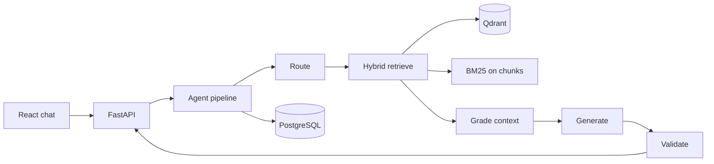

# ContextForge Architecture

## Overview

ContextForge is an agentic RAG platform: users upload documents, ask questions, and receive grounded answers with citations. A LangGraph-style pipeline routes queries, retrieves context with hybrid search, grades relevance, generates answers, and validates grounding.

## Data split

| Store | Responsibility |
|-------|----------------|
| **PostgreSQL** | Documents, chunks (text + metadata), threads, messages, optional LangGraph checkpoint tables |
| **Qdrant** | Dense vectors for semantic retrieval (chunk id as point id) |

Vectors are not duplicated in Postgres beyond `qdrant_point_id` on chunks.

### Pluggable retrieval backends (planned)

| `RETRIEVAL_BACKEND` | Dense (semantic) | Sparse (lexical) | Status |
|---------------------|------------------|------------------|--------|
| `qdrant` (default) | Qdrant ANN | BM25 in Python over `chunks.content` | **Implemented** |
| `postgres` | pgvector on `chunks.embedding` | Postgres FTS (`tsvector` + GIN) | **Planned** |

Setting: `RETRIEVAL_BACKEND` in config (see `.env.example`). Code markers: grep `TODO(retrieval-backend)` or read `app/retrieval/factory.py` for the integration checklist.

**UI-selectable backend (planned):** Operators or demo users choose Qdrant vs Postgres retrieval from the React chat UI; the choice is sent on query (and ingest) requests and applied via `app/retrieval/factory.py` (see `TODO(retrieval-backend-ui)` at the bottom of that file). Server env remains the default when the UI does not override.

## Request flow

## Agent pipeline

1. **route** — `RouteDecision` via Instructor/heuristics (`direct` | `single_hop_rag` | `multi_hop`)
2. **retrieve** — dense (Qdrant) + sparse (BM25) → RRF → lexical rerank
3. **grade_context** — abstain if top score &lt; `GRADE_MIN_SCORE`
4. **generate** — answer from contexts (or abstain message)
5. **validate_answer** — lightweight grounding check

## Design tradeoffs

1. **Qdrant vs Postgres for vectors** — Qdrant for ANN search today; Postgres for relational state. Optional future mode consolidates vectors + FTS in Postgres (`RETRIEVAL_BACKEND=postgres`); see table above.
2. **Hybrid retrieval** — BM25 catches exact policy terms; dense embeddings catch paraphrases. RRF merges ranked lists without score normalization.
3. **Abstain vs always-answer** — Low retrieval grade returns a fixed abstain string instead of hallucinating; validator can also force abstain.

## Conventions

See [docs/CODING_STANDARDS.md](docs/CODING_STANDARDS.md): no single-char variables, concise docstrings with examples, Pydantic/dataclasses over dicts, DRY/YAGNI/SOLID, files under 300 lines, one TODO per review/commit cycle.

## Tooling

| Area | Stack |
|------|--------|
| API | FastAPI, Pydantic v2, structlog |
| LLM structured output | Instructor (+ heuristics fallback), shared models in `app/llm/models.py` |
| Orchestration | LangGraph `StateGraph` compiled at startup; optional `AsyncPostgresSaver` checkpointer; `thread_id` per query |
| Frontend | Vite, React, Tailwind v4, Biome, Vitest, pnpm |
| Tasks | `just` (not Make) |

## Evaluation

Golden Q/A pairs live in `eval/golden.jsonl`. Run `cd backend && uv run python ../eval/run_ragas.py` after seeding the corpus and starting the API (requires RAGAS dev deps + LLM API for full metrics).

---

## Future: UI-driven retrieval backend (optional Postgres path)

When the Postgres profile (`pgvector` + FTS) is implemented, expose it as an **optional** mode alongside Qdrant:

1. **Server default** — `RETRIEVAL_BACKEND` in `.env` / `Settings`.
2. **Per-request override** — optional field on `QueryRequest` / ingest body (see `TODO(retrieval-backend-ui)` in `app/api/v1/query/schemas.py`).
3. **React UI** — toggle in DebugPanel or a settings drawer; `localStorage` + send override on each query/upload.
4. **Factory** — `app/retrieval/factory.py` applies override → env default; full checklist in `TODO(retrieval-backend-ui)` at the end of that file.

Grep: `TODO(retrieval-backend-ui)`.
