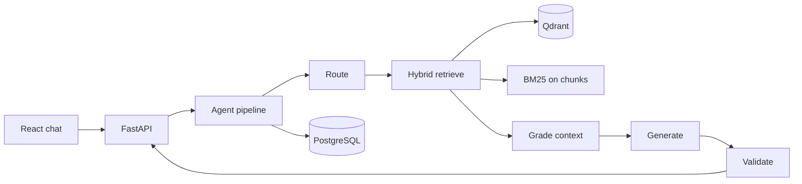

# ContextForge Architecture

## Overview

ContextForge is an agentic RAG platform: users upload documents, ask questions, and receive grounded answers with citations. A LangGraph-style pipeline routes queries, retrieves context with hybrid search, grades relevance, generates answers, and validates grounding.

## Data split

| Store | Responsibility |
|-------|----------------|
| **PostgreSQL** | Documents, chunks (text + metadata), threads, messages, optional LangGraph checkpoint tables |
| **Qdrant** | Dense vectors for semantic retrieval (chunk id as point id) |

Vectors are not duplicated in Postgres beyond `qdrant_point_id` on chunks.

## Request flow

## Agent pipeline

1. **route** — `RouteDecision` via Instructor/heuristics (`direct` | `single_hop_rag` | `multi_hop`)
2. **retrieve** — dense (Qdrant) + sparse (BM25) → RRF → lexical rerank
3. **grade_context** — abstain if top score &lt; `GRADE_MIN_SCORE`
4. **generate** — answer from contexts (or abstain message)
5. **validate_answer** — lightweight grounding check

## Design tradeoffs

1. **Qdrant vs Postgres for vectors** — Qdrant for ANN search; Postgres for relational state and auditability. pgvector deferred to keep the demo stack simple.
2. **Hybrid retrieval** — BM25 catches exact policy terms; dense embeddings catch paraphrases. RRF merges ranked lists without score normalization.
3. **Abstain vs always-answer** — Low retrieval grade returns a fixed abstain string instead of hallucinating; validator can also force abstain.

## Tooling

| Area | Stack |
|------|--------|
| API | FastAPI, Pydantic v2, structlog |
| LLM structured output | Instructor (+ heuristics fallback), shared models in `app/llm/models.py` |
| Orchestration | Imperative pipeline mirroring LangGraph nodes; Postgres checkpointer on startup |
| Frontend | Vite, React, Tailwind v4, Biome, Vitest, pnpm |
| Tasks | `just` (not Make) |

## Evaluation

Golden Q/A pairs live in `eval/golden.jsonl`. Run `cd backend && uv run python ../eval/run_ragas.py` after seeding the corpus and starting the API (requires RAGAS dev deps + LLM API for full metrics).
