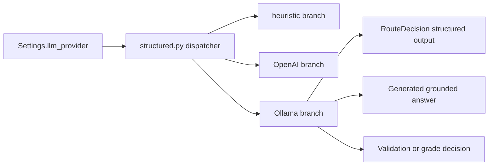

# Ollama Integration Plan

> Local LLM provider for all LLM-like graph nodes. Parent folder: `Personal/ai-projects/contextforge/`.
> Status: planned (not yet implemented).

## Goal

Add local Ollama support so ContextForge can run all LLM-like behavior without OpenAI: route decision, answer generation, and validation/grade-style decisions where applicable. Provider selection is **environment-only** (no per-request or UI toggle in this phase).

## Scope (confirmed)

| Area | In scope |
|------|----------|
| Route classification | Yes |
| Answer generation | Yes |
| Validation / grade (LLM-style decisions) | Yes |
| Provider selection | `LLM_PROVIDER` in `.env` only |
| Embeddings / reranker | No |
| Retrieval backend (`qdrant` / `postgres`) | No |

## Current state summary

- Config already includes `ollama_base_url` and `ollama_model` in `backend/app/core/config.py`.
- LLM logic is split between heuristics and OpenAI-backed adapters in:
  - `backend/app/llm/structured.py`
  - `backend/app/llm/instructor_route.py`
  - `backend/app/llm/pydantic_ai_route.py`
- Generation today is mostly heuristic text assembly in `generate_from_context(...)` inside `structured.py`.
- Graph nodes call the same public functions (`decide_route`, `generate_from_context`, `validate_answer`, `grade_retrieval`) from `backend/app/graph/nodes.py` — orchestration should stay unchanged.

## Implementation design



## Step-by-step changes

### 1. Ollama provider module

- **New file:** `backend/app/llm/ollama_provider.py`
- **Responsibilities:**
  - Call Ollama chat API (`httpx`, no new heavy deps)
  - Structured JSON outputs for `RouteDecision`, `RetrievalGrade`, `AnswerValidation`
  - Text generation for grounded answers from retrieved contexts
  - Parse responses into existing Pydantic models
  - Log failures; allow caller to fall back to heuristics

### 2. Dispatcher updates

- **File:** `backend/app/llm/structured.py`
- Add `llm_provider=ollama` branch for:
  - `decide_route`
  - `generate_from_context` (replace template-only output when Ollama is active)
  - `validate_answer` / `grade_retrieval` where applicable
- Preserve heuristic fallback when Ollama is down or returns invalid JSON

### 3. Graph layer (no API surface change)

- **File:** `backend/app/graph/nodes.py`
- Keep calling the same `structured.py` entry points so LangGraph behavior and tests stay stable

### 4. Configuration

- **File:** `backend/app/core/config.py`
  - Document allowed providers: `heuristic`, `openai`, `pydantic_ai`, `ollama`
  - Log active provider + Ollama base URL/model at startup when `LLM_PROVIDER=ollama`
- **File:** `.env.example`
  - Example block:

```env
LLM_PROVIDER=ollama
OLLAMA_BASE_URL=http://localhost:11434
OLLAMA_MODEL=llama3.2
```

### 5. Tests

- **Extend:** `backend/tests/test_structured.py`
- **New:** `backend/tests/test_ollama_provider.py` (mocked HTTP responses)
- Cases: valid JSON, invalid JSON → heuristic fallback, route + generate + grade/validate paths
- Default CI remains `LLM_PROVIDER=heuristic` in `backend/tests/conftest.py`

### 6. Documentation (after implementation)

- `README.md` — “Run with Ollama” (install Ollama, `ollama pull`, env, startup order)
- `ARCHITECTURE.md` — provider matrix, env-only policy
- `CODING_STANDARDS.md` — provider module pattern (no inline third-party imports in `structured.py`)

## Planned local run (reference)

```bash
# Terminal: Ollama
ollama serve
ollama pull llama3.2   # or your chosen model

# Terminal: ContextForge (existing stack)
cp .env.example .env
# Set LLM_PROVIDER=ollama, OLLAMA_BASE_URL, OLLAMA_MODEL
just up && just migrate && just seed
just api-dev
just web-dev
```

## Acceptance criteria

- With `LLM_PROVIDER=ollama`, route, answer generation, and validation/grade logic use Ollama-backed paths.
- Ollama unavailable or malformed responses → graceful fallback + structured log warning.
- `heuristic`, `openai`, and `pydantic_ai` modes still work.
- Backend tests pass, including new Ollama-specific tests.
- README documents reproducible Ollama setup.

## Out of scope (this phase)

- Per-request / UI provider switching
- Ollama for embeddings or cross-encoder rerank
- Retrieval backend changes (`RETRIEVAL_BACKEND=postgres`, etc.)

## Implementation todos

| ID | Task |
|----|------|
| `add-ollama-provider` | Create `ollama_provider.py` with structured + text generation helpers |
| `wire-dispatcher` | Extend `structured.py` for `llm_provider=ollama on all LLM paths |
| `config-and-env` | Harden config validation; update `.env.example` |
| `tests-ollama` | Mocked Ollama unit tests + fallback coverage |
| `docs-ollama` | Update README, ARCHITECTURE, CODING_STANDARDS after code lands |
