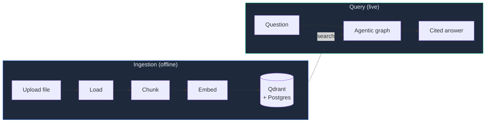
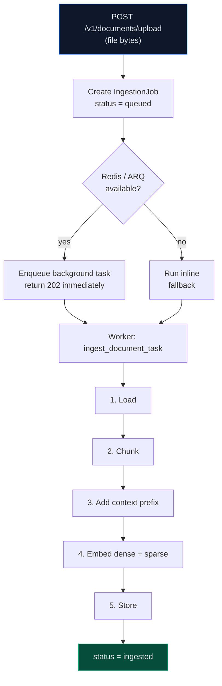
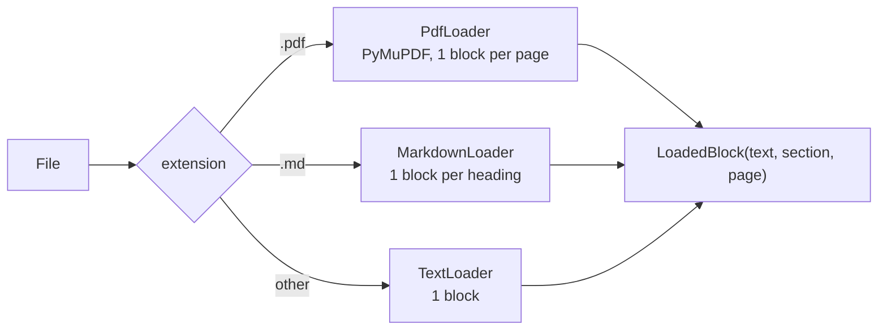
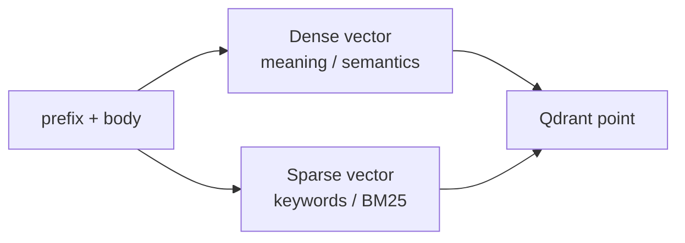
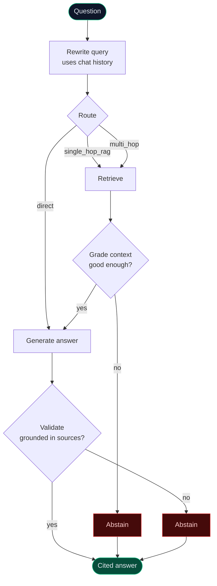
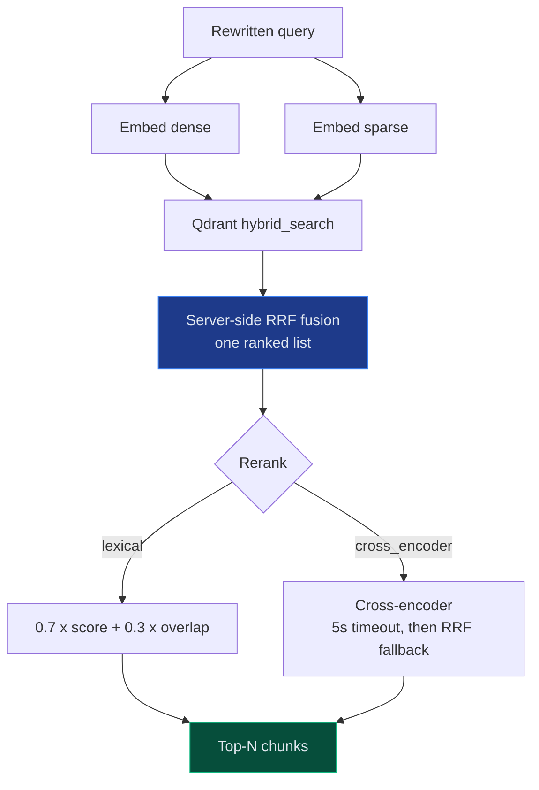
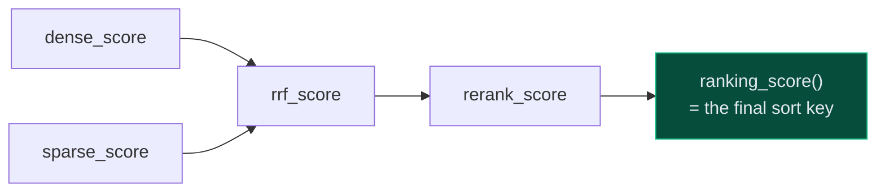
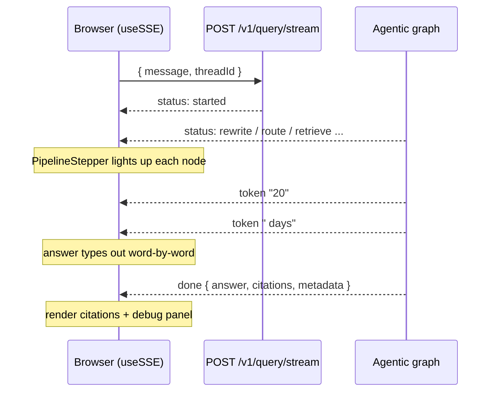
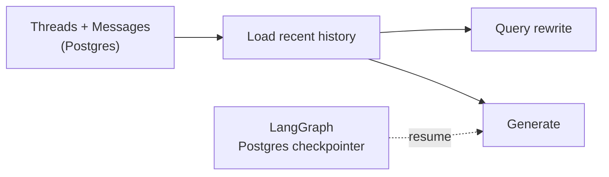

# How RAG Works in ContextForge

A visual, friendly tour of the two flows that make ContextForge answer questions
about your documents — with citations, streamed live, and a refusal to make
things up.

> **TL;DR** — Two pipelines:
> 1. **Ingestion (write path)** — turn a file into searchable vectors.
> 2. **Query (read path)** — turn a question into a grounded, cited answer.

---

## The big picture



- **Ingestion** runs once per document, in the background.
- **Query** runs every time you ask something, streamed token-by-token.
- They meet at the **vector store**: ingestion fills it, queries search it.

---

## Flow 1 — Ingestion (write path)

> **Goal:** file in → searchable chunks out, without blocking the user.



### The 5 ingestion steps

**1. Load** — route by file type → a list of `LoadedBlock`s (text + page + section).



**2. Chunk** — split each block into ~800-char pieces (120-char overlap) so
neighbors share context.

| Knob | Value |
|------|-------|
| Chunk size | 800 chars |
| Overlap | 120 chars |
| Splitter | recursive on `\n\n`, `\n`, ` ` |

**3. Add a context prefix** — prepend *where this chunk lives* before embedding,
so an isolated chunk still carries its meaning.

```
Document: handbook.pdf > Section: PTO

20 days of paid leave per year...
```
- **Default:** static structural prefix (above).
- **`CONTEXTUAL_RETRIEVAL_ENABLED=true`:** an LLM writes a 1–2 sentence situating blurb instead.

**4. Embed — two vectors per chunk** (the key to hybrid search):



| Backend | Dense | Sparse |
|---------|-------|--------|
| `sentence-transformers` *(default)* | MiniLM, 384-dim | FastEmbed BM25 |
| `bge-m3` *(local-first)* | BGE-M3, 1024-dim | BGE-M3 lexical weights |

> 💡 One model (BGE-M3) can produce **both** vectors — that's the local-first payoff.

**5. Store** — chunk text + metadata go to **Postgres**; both vectors go to
**Qdrant** as one point with **named vectors** `dense` + `sparse`.

> 🔑 The Qdrant collection is **dimension-keyed** (`contextforge_384`,
> `contextforge_1024`) so swapping embedders never mixes incompatible vectors.

---

## Flow 2 — Query (read path)

> **Goal:** question → the *best* chunks → a grounded answer, or an honest "I don't know."

This is the **agentic graph** — it routes, retrieves, self-grades, generates,
and validates. Each box is a LangGraph node.



### The three routes

The **Route** node classifies the question and picks the cheapest path that can
answer it — only `single_hop_rag` and `multi_hop` ever touch the documents.

| Route | When it's chosen | What happens |
|-------|------------------|--------------|
| **`direct`** | Greetings, chit-chat, or general-knowledge questions the docs aren't needed for | **Skips retrieval entirely** — straight to Generate (no Grade, no Validate) |
| **`single_hop_rag`** | A fact answerable from one place in the corpus ("How many PTO days?") | **One** hybrid-search pass, then Grade -> Generate -> Validate |
| **`multi_hop`** | Questions that need facts stitched from several spots ("Compare the PTO and parental-leave policies") | **Two** retrieval passes (the query, then a `"<query> details"` follow-up), merged and deduped, then the normal path |

> Why it matters: routing avoids wasting an LLM call (and latency) on "hi", while
> `multi_hop` widens the evidence net so comparison/synthesis questions don't miss
> a source that a single search would have ranked too low.

### What each node does

| Node | Question it answers | Smart bit |
|------|--------------------|-----------|
| **✏️ Rewrite** | "What is the user *really* searching for?" | Folds in chat history → standalone query |
| **🧭 Route** | "Does this even need the docs?" | `direct` skips retrieval entirely |
| **🔍 Retrieve** | "Which chunks are relevant?" | Hybrid search + rerank (below) |
| **📊 Grade** | "Are these chunks good enough to answer?" | If not → abstain *before* spending an LLM call |
| **✍️ Generate** | "Write the answer from these chunks." | Only sees the selected chunks |
| **✅ Validate** | "Is every claim backed by a chunk?" | If not → throw the answer away, abstain |

> 🛡️ **Abstain-over-hallucinate.** There are **two** exits to "I don't know":
> before generating (weak chunks) and after generating (ungrounded answer).
> Generation, citations, and validation all bind to the **same** selected chunk
> set — so no citation can exist for context the model never saw.

---

### Inside "Retrieve" — hybrid search + rerank



1. **Embed the query** two ways — dense (meaning) + sparse (keywords).
2. **Search both** in Qdrant; it fuses them **server-side** with RRF
   (Reciprocal Rank Fusion) into one ranked list.
3. **Rerank** the top candidates for precision, then keep the top-N.

> 💡 **Why hybrid?** Dense catches *paraphrases* ("time off" ≈ "PTO"); sparse
> catches *exact terms* ("401k", "VPN"). RRF gets the best of both.

---

### One score, end to end

Each chunk accumulates scores as it flows through retrieval — nothing is thrown
away, so the UI can show *why* a chunk ranked where it did.



`ranking_score()` returns the latest stage's score (rerank, then rrf, then dense),
so every downstream consumer agrees on a single ordering.

---

## Flow 3 — Streaming to the browser

The graph doesn't wait until it's done — it **narrates itself live** over
Server-Sent Events (SSE), which is how the UI animates the pipeline.



### SSE event types

| Event | Payload | UI effect |
|-------|---------|-----------|
| `status` | `{ stage, phase, detail }` | Animate the pipeline diagram |
| `token` | `{ content }` | Stream answer text |
| `done` | `{ result }` | Render citations + metadata |
| `error` | `{ detail, correlationId }` | Show error |

The frontend (`useChat` → `chatReducer`) turns these into:
- **PipelineStepper / PipelineDiagram** — live node-by-node progress.
- **Citations** — collapsible sources with scores.
- **DebugPanel** — route, abstained?, nodes visited, retrieval scores.

---

## Multi-turn memory



- Every turn is saved to a **thread**; history feeds query rewrite + generation.
- Optional **Postgres checkpointer** makes graph runs resumable.

---

## The config knobs (cheat sheet)

| Setting | Default | What it changes |
|---------|---------|-----------------|
| `EMBEDDING_BACKEND` | `sentence-transformers` | `hash` (tests) · `bge-m3` (local) |
| `CONTEXTUAL_RETRIEVAL_ENABLED` | `false` | LLM blurb vs. static prefix |
| `RERANK_BACKEND` | `lexical` | `cross_encoder` for ML rerank |
| `RERANK_TIMEOUT_S` | `5.0` | Slow reranker → fall back to RRF order |
| `RETRIEVAL_TOP_K` | `20` | Candidates fetched before rerank |
| `RERANK_TOP_N` | `5` | Chunks kept for generation |
| `GRADE_MIN_SCORE` | `0.25` | Below this → abstain |

---

## How we know it's good — evals

ContextForge measures **retrieval quality** with standard IR metrics on a golden
question set, comparing configs side-by-side:

| Metric | The question it answers |
|--------|------------------------|
| recall@k | Is a correct doc in the top *k*? |
| MRR | How high is the first correct doc? |
| nDCG@k | Are correct docs ranked near the top? |

Run from the UI (**EvalPanel**) or the deterministic `pytest -m eval` gate —
which runs **Qdrant-free** so quality never silently regresses.

---

## One-paragraph recap

> Upload a file → it's **loaded, chunked, and embedded into dense + sparse
> vectors** stored in Qdrant. Ask a question → an **agentic graph rewrites it,
> routes it, runs hybrid search + rerank, grades the results, generates an
> answer only from the chosen chunks, and validates that answer is grounded** —
> abstaining rather than hallucinating. The whole run **streams live** to the
> browser with citations and a visual pipeline.
