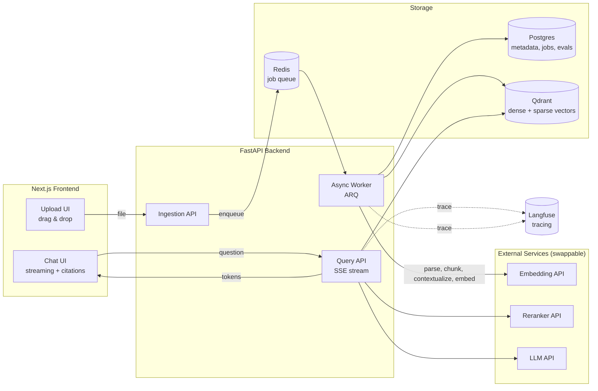
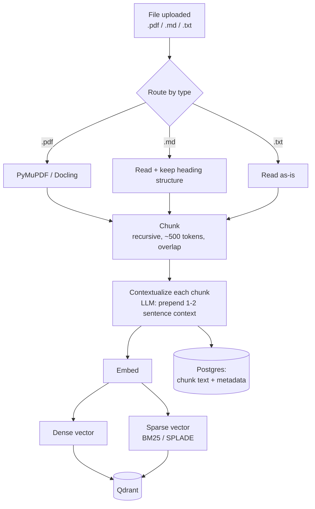
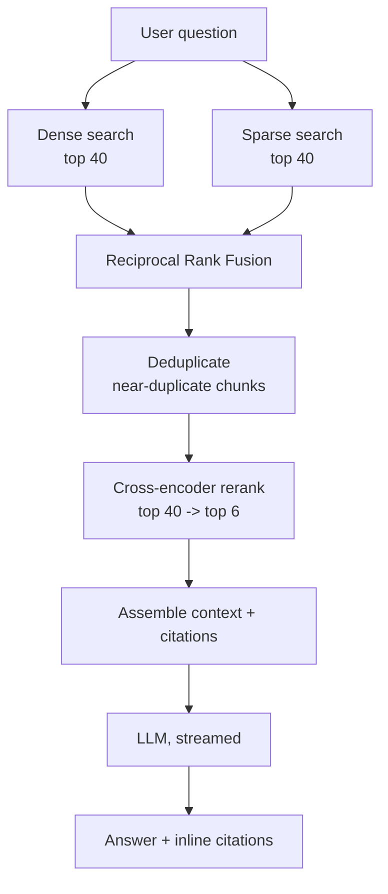

# RAG System — Architecture & Build Plan

A production-minded Retrieval-Augmented Generation system for question-answering over uploaded documents (PDFs, Markdown, text). Built to be a full-stack portfolio piece: **Python / FastAPI backend + Next.js / React frontend**, demonstrating a modern hybrid-retrieval pipeline, an evaluation harness, and observability — the things that separate a real system from a weekend demo.

---

## 1. Goals & non-goals

**Goals**
- Upload documents, ask questions, get streamed answers with **inline citations** back to the exact source chunks.
- Implement a genuinely modern retrieval pipeline: **contextual chunking → hybrid (dense + sparse) retrieval → RRF fusion → cross-encoder reranking → deduplication**.
- Ship the things most demos skip and hiring managers notice: an **evaluation harness** (recall@k, MRR, nDCG, faithfulness), **request tracing**, async ingestion, and clean API design.
- Be cheap to run and easy to spin up (`docker compose up`).

**Non-goals (v1)**
- Multi-tenant auth/billing, fine-tuned embedding models, GraphRAG, multimodal (image) retrieval. These are listed as stretch goals (§13) so the README signals awareness without bloating the core.

---

## 2. High-level architecture



Two clear flows: a **write path** (ingestion, slow, async, off the request thread) and a **read path** (query, latency-sensitive, streamed). Keeping them separate is the single most important architectural decision — ingestion does expensive LLM/embedding work that must never block a user's question.

---

## 3. Tech stack

| Layer | Choice | Why this, for a portfolio |
|---|---|---|
| **Backend** | Python 3.12, FastAPI, Pydantic v2, `uv` | Async-native, type-safe, the de facto RAG/ML language. `uv` for fast, modern dependency management. |
| **Async jobs** | ARQ (async Redis queue) | Pairs naturally with FastAPI's async model. Celery + Redis is the heavier, more "enterprise" alternative if you'd rather show that. |
| **Vector + sparse store** | **Qdrant** | Native support for *both* dense and sparse vectors in one collection, with server-side hybrid fusion. Cleaner than bolting BM25 onto a pure vector DB. |
| **Metadata store** | Postgres | Documents, chunks, ingestion jobs, eval runs. Shows SQL/relational modeling. |
| **Embeddings** | Pluggable dense provider + **FastEmbed** BM25/SPLADE sparse (local, no GPU). Dense options: Google `gemini-embedding-2`/`-001`, Voyage `voyage-3`, OpenAI `text-embedding-3-large`, or local (BGE-M3 / nomic-embed). | One model isn't required for hybrid — FastEmbed gives you the sparse arm locally and free. Dense is provider-swappable (see §3.1). **BGE-M3** is notable: one open model that emits dense *and* sparse for a fully local story. |
| **Reranker** | Pluggable: Cohere Rerank 3.5 (hosted) or `bge-reranker-v2-m3` (local) | Easiest hosted integration for the biggest single quality win; the local cross-encoder runs fine on Apple Silicon (see §3.1). |
| **LLM (generator)** | Pluggable: Claude (Anthropic), GPT (OpenAI), Gemini (Google), or local **Gemma 4** via Ollama/MLX | Swappable behind a `Generator` interface. Prompt caching makes contextual retrieval affordable (see §4.1). Local Gemma 4 gives you a zero-cost, offline-capable option (see §3.1). |
| **File parsing** | `.pdf` → PyMuPDF (fast text) + **Docling** for complex layouts/tables; `.md` and `.txt` → read directly | Docling (IBM) handles tables/structure far better than naive extraction. Plain-text and Markdown need no extraction at all — and Markdown's headings give you *free* high-quality chunk boundaries. |
| **Frontend** | Next.js 15 (App Router), TypeScript, Tailwind, shadcn/ui, Vercel AI SDK, react-dropzone | Modern, hireable frontend stack. AI SDK handles token streaming + UI state cleanly. |
| **Observability** | Langfuse (open-source, self-hosted) | Per-request traces of retrieval → rerank → generation, with latency and token cost. This is a standout portfolio feature. |
| **Eval** | RAGAS + custom retrieval metrics | Faithfulness, answer relevance, plus recall@k / MRR / nDCG on a golden set. |
| **Local infra** | Docker Compose | One command brings up Postgres, Qdrant, Redis, Langfuse. |

> **Provider abstraction:** wrap embeddings, reranking, and LLM calls behind thin `Protocol` interfaces (`Embedder`, `Reranker`, `Generator`). It keeps API keys swappable, makes the eval harness able to compare providers, and reads as good engineering judgment.

### 3.1 Multi-provider support & running locally

Every model-backed step is chosen at runtime from an env var (e.g. `EMBEDDER=google`, `GENERATOR=gemma4-local`), resolved by a small factory into the right adapter. This is genuinely valuable on a portfolio: it lets you demo the same system running **fully on hosted APIs** *or* **fully offline on your Mac**, and it lets the eval harness (§8) compare providers head-to-head on *your* data.

**Supported providers per capability**

| Capability | Hosted options | Local options (Apple Silicon) |
|---|---|---|
| **Dense embeddings** | Google `gemini-embedding-2` (multimodal) / `gemini-embedding-001` (text), Voyage `voyage-3`, OpenAI `text-embedding-3-large`, Cohere `embed-v4` | **BGE-M3** (dense + sparse in one model), `nomic-embed-text`, `mxbai-embed-large` — served via Ollama or MLX |
| **Sparse embeddings** | — (computed locally regardless) | **FastEmbed** BM25 / SPLADE — CPU-only, no GPU needed |
| **Reranker** | Cohere Rerank 3.5, Voyage rerank | `bge-reranker-v2-m3` (cross-encoder) via a small local server |
| **LLM (generation + contextualization)** | Claude (Anthropic), GPT (OpenAI), Gemini (Google) | **Gemma 4** via `ollama run gemma4`, or MLX for max throughput |

**Why this is easy to implement.** Each adapter is ~30–60 lines implementing one `Protocol`. Hosted adapters wrap the vendor SDK; local adapters point at a localhost endpoint. Because Ollama exposes an **OpenAI-compatible API**, your "OpenAI" adapter often works against a local Gemma 4 just by changing the base URL — so "local mode" can be nearly free to add.

**Running fully local on your M5 Pro (48 GB unified memory).** This machine is comfortably oversized for the whole pipeline — 48 GB lets you hold the generator, embedder, and reranker resident *at the same time* with room for your dev environment:

- **Generator — Gemma 4 (Google's April 2026 open family, Apache-2.0).** It ships in several sizes (≈2B/4B edge variants, a 26B Mixture-of-Experts, and a 31B dense model, plus a 12B). On 48 GB the sweet spot is the **26B MoE** (fast, since only a fraction of params activate per token) or the **31B dense at 4-bit quantization** (~18–20 GB resident) when you want maximum quality. Start it with `ollama run gemma4`. For the best tokens/sec on Apple Silicon, serve via **MLX** (Apple's Metal-backed framework) instead of Ollama; **LM Studio** is the easiest GUI if you prefer clicking.
- **Embedder — BGE-M3** (gives you dense *and* learned-sparse from a single model, neat for hybrid) or `nomic-embed-text`. A couple of GB at most.
- **Reranker — `bge-reranker-v2-m3`**, a small cross-encoder that runs in well under a second per batch on this hardware.
- **Tooling — Ollama** (simplest, OpenAI-compatible endpoint), **MLX / mlx-lm** (fastest on Apple Silicon), or **LM Studio** (GUI). All keep data on-device — a nice privacy/offline angle to mention.

> Practical note: local mode trades a little answer quality and speed for **$0 cost, full privacy, and offline operation**. Keep a hosted provider configured too, so your *deployed* demo (where you can't ship a 20 GB model) uses an API while your *local* dev/demo can run entirely on the Mac. Showing both in one codebase is the impressive part.

---

## 4. The RAG pipeline

This is the core of the project and the part worth getting right. It directly implements the hybrid-retrieval architecture (the empirically strongest approach in current benchmarks): hybrid retrieval typically beats dense-only by a wide margin on recall, and a cross-encoder reranker delivers the largest single precision gain on top.

### 4.1 Ingestion (write path, async)



1. **Parse (route by file type)** — a small dispatcher picks the right loader per extension:
   - **`.pdf`** → PyMuPDF for clean prose, Docling when the document has tables/complex layout. Preserve page numbers + section headers as metadata (needed for citations).
   - **`.md`** → read directly; no extraction needed. Parse the heading hierarchy (`#`, `##`, …) and use it both as chunk boundaries and as `section` metadata. Markdown effectively hands you high-quality, semantically-aligned chunks for free.
   - **`.txt`** → read as-is; fall back to the recursive splitter since there's no inherent structure.
   
   Keep this behind a `DocumentLoader` interface so adding `.docx`/`.html` later is a one-file change.
2. **Chunk** — recursive splitting at ~400–600 tokens with ~50–80 token overlap, respecting headings/paragraphs. Store `document_id`, `page`, `section`, and char offsets.
3. **Contextualize (Contextual Retrieval)** — for each chunk, make a cheap LLM call that, given the whole document, writes a 1–2 sentence situating blurb ("This section of the 2023 annual report discusses..."), and **prepend it to the chunk before embedding**. Anthropic's data showed this cut retrieval failures meaningfully. Use **prompt caching** on the document so you pay for the long document once, not once per chunk — this is what makes the technique affordable.
4. **Embed** — produce a dense vector (semantic) and a sparse vector (lexical) per chunk.
5. **Index** — upsert both vectors into Qdrant; store the raw chunk text + metadata in Postgres. Update the ingestion job status so the frontend can show progress.

### 4.2 Retrieval & generation (read path, streamed)



1. **Hybrid retrieve** — run dense and sparse search in parallel, each returning ~40 candidates. Dense catches paraphrase and concept; sparse catches exact terms, codes, acronyms, and rare entities that dense silently misses.
2. **RRF fusion** — merge the two ranked lists with Reciprocal Rank Fusion (`score = Σ 1/(k + rank)`, `k≈60`). RRF works on rank position, so it sidesteps the incompatible-score-scale problem between BM25 and cosine. Qdrant can do this server-side.
3. **Deduplicate** — drop near-duplicate chunks (overlapping or republished content) so the limited LLM context holds *diverse* evidence. Cheap cosine-threshold or MMR pass.
4. **Rerank** — send the fused top ~40 to the cross-encoder, keep the top ~6. This is the biggest precision lever: it reads query and chunk *together* and reorders so the genuinely relevant chunk lands at rank 1–3 (what the LLM actually attends to). Run it **async / non-blocking with a timeout and a fallback** to the un-reranked list, so a slow reranker degrades gracefully instead of stalling the response.
5. **Generate** — assemble the top chunks into a grounded prompt with citation markers, stream tokens to the client via SSE, and return structured citations alongside the text.

> **Tuning knobs to expose (and write up):** candidate count per arm, RRF `k`, rerank top-N, chunk size/overlap, and whether contextualization is on. Being able to flip these and show the eval impact (§9) is a strong portfolio narrative.

---

## 5. Data model (sketch)

**Postgres**
- `documents(id, filename, title, status, page_count, created_at)`
- `chunks(id, document_id, ordinal, text, context_blurb, page, section, char_start, char_end)`
- `ingestion_jobs(id, document_id, state, progress, error, started_at, finished_at)`
- `eval_runs(id, config_json, dataset, created_at)` and `eval_results(id, run_id, metric, value)`

**Qdrant** — one collection, two named vectors per point:
- `dense` (e.g. 1024-dim, cosine) and `sparse` (BM25/SPLADE). Payload mirrors `chunk_id`, `document_id`, `page` for filtering and citation hydration.

---

## 6. API design

| Method | Endpoint | Purpose |
|---|---|---|
| `POST` | `/documents` | Upload a file → enqueue ingestion → return `job_id` |
| `GET` | `/documents` | List documents + ingestion status |
| `GET` | `/jobs/{id}` | Poll ingestion progress (or use SSE) |
| `DELETE` | `/documents/{id}` | Remove document + its vectors/chunks |
| `POST` | `/chat` | Ask a question → **SSE stream** of tokens + a final citations payload |
| `POST` | `/eval/run` | Trigger an eval run against the golden set |
| `GET` | `/eval/runs` | Retrieve eval results for the dashboard |

The `/chat` endpoint returns Server-Sent Events: token deltas during generation, then a terminal event carrying the resolved citations (document, page, snippet) so the UI can render footnotes.

---

## 7. Frontend architecture

- **Upload view** — drag-and-drop (react-dropzone), per-file ingestion progress (parsing → embedding → ready) driven by job polling/SSE.
- **Chat view** — streaming message bubbles via the Vercel AI SDK; assistant answers render inline citation chips that, on click, open the source chunk with page reference.
- **Eval dashboard** — a table/chart of metric values across configs (e.g. dense-only vs. hybrid vs. hybrid+rerank). This visualizes *why* the pipeline is built the way it is — a great thing to walk an interviewer through.
- shadcn/ui + Tailwind for a clean, consistent look; keep it minimal and fast.

---

## 8. Evaluation harness (the differentiator)

Most RAG demos can't answer the one question an interviewer will ask: *"How do you know it's any good?"* This section is how you answer it. The core idea is simple — **you can't improve what you don't measure** — and RAG has *two* places it can break, so you measure both:

1. **Retrieval** — did we fetch the right chunks? (If this fails, nothing downstream can save you.)
2. **Generation** — given those chunks, did the LLM write a correct, grounded answer?

Knowing *which* of the two broke is the whole point. A wrong answer because the retriever never found the relevant chunk is a totally different fix from a wrong answer where the retriever nailed it but the LLM hallucinated.

### Step 1 — Build a "golden set"

A golden set is just a small, hand-curated answer key for your corpus. For each test question you record: the question, which chunk(s) are *actually* relevant, and a short ground-truth answer. Aim for ~30–80 questions covering easy lookups, multi-chunk questions, and exact-term queries (codes/acronyms — the ones that stress the sparse arm).

Think of it like a teacher's answer key. Example entry, over a company employee handbook:

```jsonc
{
  "question": "How many vacation days do new employees get?",
  "relevant_chunk_ids": ["pto-policy-01", "pto-accrual-table-02"],
  "ground_truth": "New employees receive 15 paid vacation days per year."
}
```

You write this once. Every eval run scores the pipeline against it automatically.

### Step 2 — Retrieval metrics (custom, cheap, no LLM needed)

These compare the chunks your retriever returned against the `relevant_chunk_ids` in your golden set. They're pure math — fast and free. We'll use the vacation-days question, where **2 chunks are truly relevant**.

**Recall@k — "Did we even find the needle?"**
Of all the truly-relevant chunks, what fraction showed up in the top *k* results?

> Say your top-5 results contain `pto-policy-01` but miss `pto-accrual-table-02`. You found 1 of the 2 relevant chunks, so **recall@5 = 1/2 = 0.5**.

Recall is the retriever's most important score. If recall@k is low, the right information never even reached the LLM — adding a fancier reranker or a smarter model won't help. Fix recall *first* (better chunking, add the hybrid sparse arm, raise *k*).

**MRR — "How high up was the first correct chunk, on average?"**
For each question, find the rank of the *first* relevant chunk and score it `1 / rank`; then average across all questions. Rank 1 → 1.0, rank 2 → 0.5, rank 4 → 0.25, never found → 0.

> Three questions, where the first relevant chunk landed at ranks **1, 3, and 2**:
> MRR = (1/1 + 1/3 + 1/2) / 3 = (1 + 0.33 + 0.5) / 3 ≈ **0.61**.

MRR matters because LLMs pay the most attention to the *earliest* chunks in their context. Getting the best chunk to rank 1 instead of rank 5 measurably improves answers — and improving MRR is exactly what the cross-encoder reranker is *for*.

**nDCG@10 — "Did we put the most relevant stuff at the top, in the best order?"**
Recall is binary (found / not found) and MRR only looks at the *first* hit. nDCG is the most complete picture: it rewards placing relevant chunks high (with a gentle logarithmic penalty the further down they sit), it accounts for *multiple* relevant chunks, and it can even handle *graded* relevance (a perfect chunk vs. a merely-okay one). It's then normalized against the best-possible ordering, so the score lands between 0 (awful) and 1 (ideal).

> Both relevant chunks at ranks 1 and 2 → nDCG ≈ **1.0** (perfect). The same two chunks at ranks 1 and 8 → maybe **~0.8**: you found them, but burying one at rank 8 (where it's discounted, and may fall outside what you feed the LLM) costs you.

Reach for `pytrec_eval` or `ir-measures` so you're using the same trusted implementations the research community uses, rather than hand-rolling the log math.

### Step 3 — Answer-quality metrics (RAGAS, LLM-judged)

Good retrieval doesn't guarantee a good answer — the LLM can still hallucinate or ramble. **RAGAS** uses an LLM as an automatic grader for these. The clever part: most need no human labels, just the question, the retrieved context, and the generated answer.

**Faithfulness — "Is the model sticking to the sources, or making things up?"**
Breaks the answer into individual claims and checks what fraction are actually supported by the retrieved context. This is your hallucination detector.

> Answer: *"New employees get 15 vacation days and 10 sick days."*
> The context supports "15 vacation days" but says **nothing** about sick days. Two claims, one supported → **faithfulness = 1/2 = 0.5**. That unsupported sick-days claim is a hallucination, and the score caught it.

**Answer relevance — "Did it actually answer the question I asked?"**
Penalizes vague, off-topic, or padded answers, even if every word is true. (RAGAS estimates this by having an LLM generate questions *from* your answer and checking how close they are to the original question.)

> Q: *"How many vacation days do new employees get?"*
> *"Our company deeply values work-life balance and offers competitive benefits."* → **low** relevance (true, but dodges the number).
> *"New employees receive 15 paid vacation days per year."* → **high** relevance (directly answers it).

**Context precision — "How much of what we retrieved was signal vs. noise?"**
Of the chunks fed to the LLM, how many were actually relevant — and were the relevant ones ranked above the junk? Low precision means you're drowning the model in irrelevant context (which both costs tokens and degrades answers).

**Context recall — "Did we retrieve *everything* needed to fully answer?"**
Compares the retrieved context against your `ground_truth` answer: is all the information the answer needs actually present in what we fetched? (This is the one RAGAS metric that uses your ground-truth labels — which is why you wrote them in Step 1.)

> If the full correct answer is *"15 days, accruing 1.25 days/month after a 90-day probation,"* but retrieval only surfaced the "15 days" chunk and missed the accrual/probation chunk, **context recall is low** even if faithfulness is perfect — the model can only be faithful to what it was given.

### Step 4 — Tie it together (the part that impresses)

Run the *entire* golden set through the pipeline under different configurations and store every score in the `eval_results` table, then chart them on the dashboard (§7):

| Config | recall@5 | MRR | nDCG@10 | faithfulness | answer relevance |
|---|---|---|---|---|---|
| Dense-only | 0.71 | 0.62 | 0.68 | 0.80 | 0.84 |
| + Hybrid (RRF) | 0.86 | 0.70 | 0.79 | 0.85 | 0.86 |
| + Reranking | 0.88 | 0.85 | 0.90 | 0.91 | 0.89 |

*(Illustrative numbers — yours will differ; the point is producing this table from your own data.)*

This table reads like a diagnosis, and that's the narrative gold:
- **Low recall?** → fix retrieval: chunking, add the sparse arm, raise *k*. (Notice hybrid lifts recall the most above.)
- **Recall high but MRR/nDCG low?** → the right chunk is in the pile but buried → add/tune the reranker. (Notice reranking lifts MRR/nDCG the most.)
- **Context good but faithfulness low?** → it's a *generation* problem → fix the prompt or swap the LLM, not the retriever.

Being able to say *"adding the reranker moved my MRR from 0.70 to 0.85 on my own golden set, and here's the chart"* — and explain *why* each number moved — is exactly the rigor that separates this from a tutorial follow-along.

**Tooling:** RAGAS for the LLM-judged answer metrics; `pytrec_eval` / `ir-measures` for recall@k / MRR / nDCG. Run it as a CLI (`uv run eval`) and via the `/eval/run` endpoint so results flow to the dashboard. Bonus: wire it into CI so a regression in retrieval quality fails the build — a very strong signal of engineering maturity.

---

## 9. Observability

Instrument the read path with Langfuse: one trace per query, with spans for dense search, sparse search, fusion, rerank, and generation — each annotated with latency and (for LLM/rerank) token/cost. You get a flame-graph view of where time goes, which is both genuinely useful for tuning and a compelling thing to demo.

---

## 10. Repository structure

```
rag-system/
├── docker-compose.yml          # postgres, qdrant, redis, langfuse
├── README.md                   # demo GIF, architecture, eval results
├── ARCHITECTURE.md             # this document
├── backend/
│   ├── pyproject.toml          # uv-managed
│   ├── app/
│   │   ├── main.py             # FastAPI app
│   │   ├── api/                # routes: documents, chat, eval
│   │   ├── ingestion/          # parse, chunk, contextualize, embed
│   │   ├── retrieval/          # hybrid search, rrf, dedup, rerank
│   │   ├── generation/         # prompt assembly, streaming
│   │   ├── providers/          # Embedder / Reranker / Generator protocols
│   │   ├── eval/               # golden set, metrics, runners
│   │   └── workers/            # ARQ tasks
│   └── tests/
└── frontend/
    ├── package.json
    └── app/                    # Next.js App Router: upload, chat, eval
```

---

## 11. Local dev & deployment

- **Local:** `docker compose up` (Postgres, Qdrant, Redis, Langfuse) + `uv run` backend + `pnpm dev` frontend. Document API keys in `.env.example`.
- **Deploy:** backend → Fly.io / Railway / Render; frontend → Vercel; Qdrant Cloud (free tier) + managed Postgres (Neon/Supabase) + managed Redis (Upstash). A live demo link is worth a lot on a portfolio.

---

## 12. Build roadmap

Sequence it so you always have something working, and add complexity only after the previous layer is solid.

1. **Phase 1 — Walking skeleton.** FastAPI + Next.js + Postgres + Qdrant. Upload → naive chunk → **dense-only** retrieval → non-streamed answer. End-to-end, ugly but working.
2. **Phase 2 — Streaming + citations.** SSE streaming on `/chat`, citation rendering in the UI, async ingestion via ARQ with progress.
3. **Phase 3 — Hybrid + fusion.** Add the sparse arm and RRF. Now you have real hybrid search.
4. **Phase 4 — Reranking + dedup.** Add the cross-encoder (async, timeout-guarded) and deduplication.
5. **Phase 5 — Contextual retrieval.** Add per-chunk contextualization with prompt caching.
6. **Phase 6 — Eval + observability.** Golden set, metrics, eval dashboard, Langfuse traces.
7. **Phase 7 — Polish.** README with a demo GIF and your eval-result table, deploy, write up the tuning experiments.

A natural commit history through these phases is itself a portfolio asset — it shows how you build.

---

## 13. Stretch goals (signal awareness without scope creep)

- **Agentic query rewriting / routing** — rewrite vague queries, or route between retrieval and direct answering.
- **Self-correction (Corrective RAG)** — grade retrieved context; re-retrieve or fall back to web search if it's weak.
- **GraphRAG** — entity/relationship extraction for multi-hop questions.
- **Multimodal** — embed figures/diagrams from PDFs.
- **Multi-tenant auth** — per-user document isolation.

Mention these in the README as "future work" — interviewers like seeing you know where the frontier is.

---

## 14. Portfolio talking points

When you walk someone through this, lead with the choices and the evidence:
- *Why hybrid over pure vector search* — exact-match queries (codes, acronyms, names) that dense embeddings silently miss, rescued by the sparse arm.
- *Why the reranker, and why async* — biggest precision win, but its latency is hidden behind the request so users don't pay for it serially, with a graceful fallback.
- *Your eval numbers* — "on my own golden set, hybrid+rerank improved recall@5 over dense-only by N%."
- *The write/read path split* — expensive ingestion never blocks a query.

> **Verify-at-build-time note:** pin exact library/model versions (FastEmbed, Qdrant client, Vercel AI SDK, Langfuse, RAGAS) and confirm current API shapes when you start coding — this fast-moving ecosystem changes APIs often.
